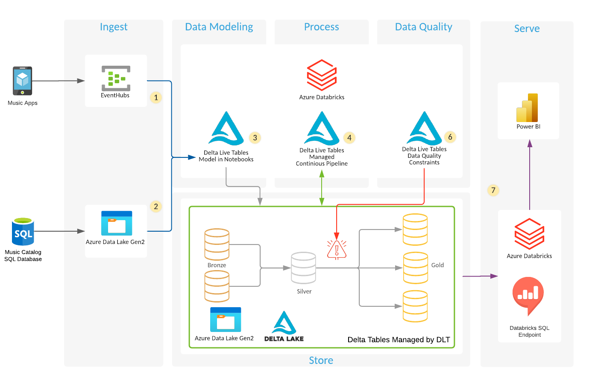

# Music App Lakehouse demo on Azure Databricks

Follow the instructions in [set up enviroment](SET-UP-ENVIROMENT.md) to create all required resources in Azure and Azure Databricks to run the demo.

## Delta Live Tables demo

Once all resources have you been created from [set up enviroment](SET-UP-ENVIROMENT.md) follow these steps to run the demo.

- Generate data in ADLS and Event Hubs Kafka topic using [data-generator](/data-generator).
- Modify the notebooks in [delta-live-tables](/delta-live-tables) to use the correct config values.
- Go to the Jobs page and Delta Live Tables tab to deploy your pipeline using the settings from [dlt-pipeline-settings-continuous.json](/delta-live-tables/dlt-pipeline-settings-continuous.json).
- Once the pipeline starts, stop it and modify the settings to apply the Spark config for secrets from [dlt-pipeline-settings-continuous.json](/delta-live-tables/dlt-pipeline-settings-continuous.json).
- Check the database and tables were create correctly using the [audit_tables](/audit_tables) notebook.
- Audit the event logs using the [Audit Event Logs](/audit_event_log/Querying the Delta Live Tables event log.py) notebook.